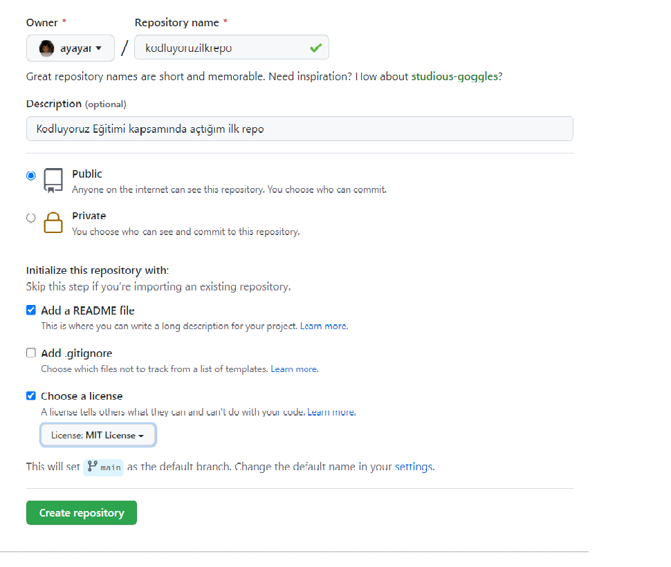

# Kodluyoruz Ilk Repo

Bu repo [Kodluyoruz](http://www.kodluyoruz.org) Front-End Eğitiminde oluşturduğumuz ilk repo. İçersinde bir adet README dosyası, bir adet index.html barındırıyor



## Intallation

Öncelikle projeyi clonlayın. (Buraya sizin reponuzdan aldığınız link gelcek)

```bash
git clone https://github.com/ayayar/kodluyoruzilkrepo.git
```

## Usage

Projeyi clonladıktan sonra Visual Studio Code programında açınız.

Linux için :
```linux
cd kodluyoruzilkrepo
code.
```

## Contributing
Pull requestler kabul edilir. Büyük değişiklikler için, lütfen önce neyi değiştirmek istediğinizi tartışmak için bir konu açınız.


## License
[MIT](https://choosealicense.com/licenses/mit/)